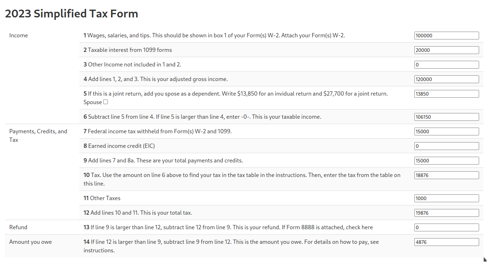

# Assignment: Creating a Tax Form

You should work in the `assignment1` folder under you personal read.
Create a file `index.html` and implement a form that looks like this 1040EZ form:

Based on https://www.irs.gov/pub/irs-prior/f1040ez--2016.pdf 

Use the following tax rates.  In each row, the first number is the tax rate, the second number is the lower bound of the tax bracket if filing separately, and the third number is the lower bound of the tax bracket if filing jointly.
        
    var rates = [[10, 0, 0]
                 [12, 11000, 22000],
                 [22, 44725, 89450],
                 [24, 95375, 190750],
                 [32, 182100, 364200],
                 [35, 231250, 462500],
                 [37, 578125, 693750]]

The form should have the following requirements:
1. It should consist of valid HTML and CSS (1 point)
2. It should use the Bulma css style and all elements must be styled accordingly. (1 point)
3. It should consist of a <table/> with 3 columns and 14 rows. (1 point)
4. Each row should have class `row-N` where N is the row number. (1 point)
5. The first column should contain a description of the input type: Income / Payments, Credits and Tax / Refund / Amount you owe. (1 point)
6. The second column should contain in bold the row number, followed by a description of the row. (1 point)
7. The third column should contain an <input/> field for the corresponding values. Each input should have name "value-N" where N is the corresponding number from the original form. (1 points)
8. Rows 4, 5, 6, 9, 10, 13, 14 should contain read-only input fields, whose value is computed via javascript (1 point).
9. Row 4 should contain the total of rows 1, 2, and 3, and be updated each time a digit is entered in such rows. (1 points)
10. Checking/unchecking the box "filing-jointly" should update the value in row 5 accordingly (1 point).
11. The form should compute the tax correctly using 2023 rates. (2 points)

## Self Grading (not final)

    grade

## Submission (for official grading)

    git add .
    git commit -a -m "assignment2"
    git push origin main
